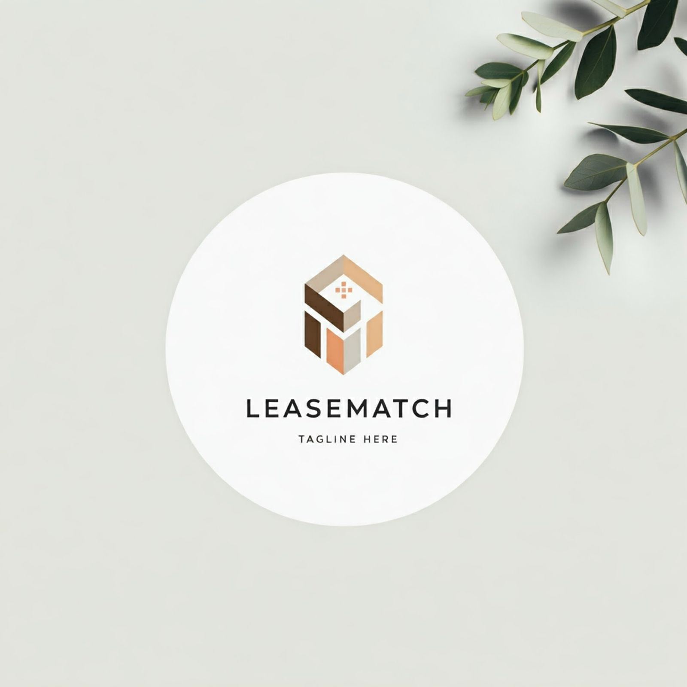
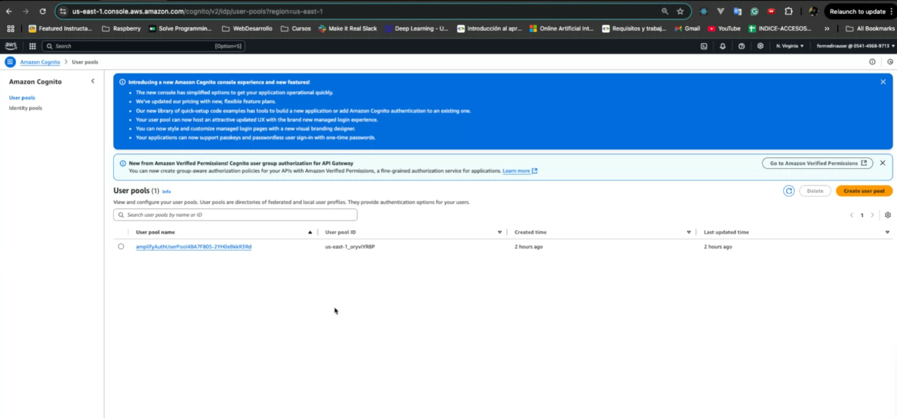

<a name="readme-top"></a>

<div align="center">
  <!-- You are encouraged to replace this logo with your own! Otherwise you can also remove it. -->
  
  <br/>

  <h3><b>Lease Match Cloud Architecture</b></h3>

</div>

<!-- TABLE OF CONTENTS -->

# 📗 Table of Contents

- [📖 About the Project](#about-project)
  - [🛠 Built With](#built-with)
    - [Tech Stack](#tech-stack)
    - [Key Features](#key-features)
  - [🚀 Live Demo](#live-demo)
- [💻 Getting Started](#getting-started)
  - [Prerequisites](#prerequisites)
  - [Setup, Install & Deployment](#setup-install-deploy)
  - [Usage](#usage)
  - 
- [👥 Authors](#authors)
- [🔭 Future Features](#future-features)
- [🤝 Contributing](#contributing)
- [⭐️ Show your support](#support)
- [🙏 Acknowledgements](#acknowledgements)
- [❓ FAQ (OPTIONAL)](#faq)
- [📝 License](#license)

<!-- PROJECT DESCRIPTION -->

# 📖 LeaseMatch <a name="about-project"></a>

> LeaseMatch simplifies the rental process by offering a fair, transparent, and flexible marketplace for housing. Whether you're looking to rent an apartment or list your property, LeaseMatch puts the power of choice and negotiation in your hands.


**LeaseMatch** is a project to showcase the concepts learned in the [Bootcamp Arquitectura en la Nube](https://talentotechbogota.co/#bootcamps) of [MinTIC Colombia](https://www.mintic.gov.co/portal/inicio/)

## 🛠 Built With <a name="built-with"></a>

### Architecture <a name="architecture"></a>

> This project is the deployment of the infrastructure required to create a complete website on AWS and following security guidelines and good practices. It uses of [AWS CDK Infrastructure as a Code]( https://docs.aws.amazon.com/cdk/v2/guide/home.html).

 <div style="text-align: center"></div>

> **Components** <a name="components"></a>
- **Lambda function**: Used to manage backend logic. The properties_lambda_function property defines the behavior of the function and the path to the code ("./infra/api"). in the code, we assume that you will have a properties.py file inside the api directory, where the logic for managing property data resides.

- **DynamoDB**: This is the NoSQL database used to store property data. The LeaseMatch_table has a primary key id that uniquely identifies each property. The Lambda function has full access to the table, allowing it to perform all database operations (CRUD).

- **API Gateway**: Acts as the entry point to the backend services, routing HTTP requests to the appropriate Lambda functions. It enables secure and scalable communication between clients and the backend, and supports enabling CORS to allow requests from different domains.

- **Amplify (React Vite)**: AWS Amplify integrates the React Vite application with AWS services, simplifying the implementation of backend features like authentication, storage, and API interactions. Amplify also provides seamless hosting and deployment options for the frontend application.

- **Cognito**: Handles user authentication and authorization, providing features such as user registration, login, and secure access to resources. It integrates easily with Amplify and supports standards like OAuth2 and OpenID Connect.

- **CloudFront**: A content delivery network (CDN) service used to distribute and cache the frontend application and other static assets globally, ensuring low latency and high availability for end users.

- **WAF (Web Application Firewall)**: Protects the application from malicious traffic by filtering requests based on custom rules, such as blocking traffic from specific geographic regions or IP addresses.

- **CI/CD**: Continuous Integration and Continuous Deployment pipelines automate the process of building, testing, and deploying the application. This ensures rapid, consistent, and error-free updates to both the frontend and backend services.

### Tech Stack <a name="tech-stack"></a>

<details>
  <summary>Frontend</summary>
  <ul>
    <li><div>To deploy the frontend on Amplify, the [AWS Quickstart Deployment Template] was used, following AWS recommendations. This guide helps developers integrate AWS Amplify into a React application, providing step-by-step instructions to set up a React project, install Amplify, configure it to use AWS services (Cognito, Vite React TS,CI/CD, and APIs), and add cloud-powered features like authentication and hosting.</div><a href="https://docs.amplify.aws/react/start/quickstart/">AWS Quickstart Deployment Template V2</a></li>
  </ul>
</details>

<details>
  <summary>Backend</summary>
  <ul><div>To deploy the backend, we used an AWS CDK stack that allows to integrate and deploy the following AWS services: apigateway, lambda, dynamodb (LeaseMatch/devops/infra/api_stack.py)</div>
    <li><a href="https://aws.amazon.com/api-gateway">API Gateway</a></li>
    <li><a href="https://aws.amazon.com/lambda">Lambda Function</a></li>
  </ul>
</details>

<details>
<summary>Database</summary>
  <ul>
     <li><a href="https://aws.amazon.com/dynamodb">Dynamo DB</a></li>
  </ul>
</details>

<details>
<summary>Firewall</summary>
  <ul><div>AWS WAF is used to protect the CloudFront distribution and source servers. </div>
     <li><a href="https://aws.amazon.com/waf">AWS WAF</a></li>
  </ul>
</details>

<!-- Deployment -->
### Frontend Deployment <a name="key-features"></a>
<table  border="1">
<thead>
    <tr>
      <th colspan="2" style="text-align: center;">AWS Amplify</th>
    </tr>
  </thead>
  <tbody>
  <tr>
    <td><div style="text-align: center"></div>
</td>
    <td><div style="text-align: center"></div>
</td>
  </tr>
  </tbody>
</table>
<table border="1">
  <thead>
    <tr>
      <th colspan="2" style="text-align: center;">Git Authorization</th>
    </tr>
  </thead>
  <tbody>
    <tr>
      <td><div style="text-align: center"></div></td>
      <td><div style="text-align: center"></div></td>
    </tr>
  </tbody>
</table>
<table border="1">
  <thead>
    <tr>
      <th colspan="2" style="text-align: center;">App deploy</th>
    </tr>
  </thead>
  <tbody>
    <tr>
      <td><div style="text-align: center"></td>
      <td><div style="text-align: center"></td>
    </tr>
     <tr>
      <td><div style="text-align: center"></td>
      <td><div style="text-align: center"></td>
    </tr>
  </tbody>
</table>
<table border="1">
  <thead>
    <tr>
      <th colspan="2" style="text-align: center;">Api Gateway & Lambdas</th>
    </tr>
  </thead>
  <tbody>
    <tr>
      <td><div style="text-align: center"></td>
      <td><div style="text-align: center"></td>
    </tr>
    <tr>
      <td><div style="text-align: center"></td>
      <td><div style="text-align: center"></td>
    </tr>
  </tbody>
</table>
<table border="1">
  <thead>
    <tr>
      <th colspan="3" style="text-align: center;">Dynamo DB</th>
    </tr>
  </thead>
  <tbody>
    <tr>
      <td><div style="text-align: center"></td>
      <td><div style="text-align: center"></td>
       <td><div style="text-align: center"></td>
    </tr>
  </tbody>
</table>
<table border="1">
  <thead>
    <tr>
      <th colspan="3" style="text-align: center;">Cloud formation</th>
    </tr>
  </thead>
  <tbody>
    <tr>
     <td><div style="text-align: center"></td>
      <td><div style="text-align: center"></td>
       <td><div style="text-align: center"></td>
    </tr>
  </tbody>
</table>
<table border="1">
  <thead>
    <tr>
      <th colspan="2" style="text-align: center;">Cognito</th>
    </tr>
  </thead>
  <tbody>
    <tr>
     <td><div style="text-align: center"></td>
      <td><div style="text-align: center"></td>
    </tr>
  </tbody>
</table>

<table border="1">
  <thead>
    <tr>
      <th colspan="2" style="text-align: center;">WAF blocked and allowed</th>
    </tr>
  </thead>
  <tbody>
    <tr>
     <td><div style="text-align: center"></td>
      <td><div style="text-align: center"></td>
    </tr>
    <tr>
     <td><div style="text-align: center"></td>
      <td><div style="text-align: center"></td>
    </tr>
  </tbody>
</table>
<!-- Features -->
### Key Features <a name="key-features"></a>

- **Use of Infrastructure as Code**
- **Use of API Gateway to expose services from Lambda functions and enable CORS.**
- **Creation and integration of Amplify, React Vite TS, Cognito, and CI/CD using the AWS template.**
- **WAF (Web Application Firewall) to allow and block traffic by region.**

<p align="right">(<a href="#readme-top">back to top</a>)</p>

<!-- LIVE DEMO -->

## 🚀 Live Demo <a name="live-demo"></a>

- [Live Demo Link](https://development.1234567890qwertyuio.amplifyapp.com)

<p align="right">(<a href="#readme-top">back to top</a>)</p>

<!-- GETTING STARTED -->

## 💻 Getting Started <a name="getting-started"></a>

To get a local copy up and running, follow these steps.
Step 1 (Backend) 
- Clone the repository using: 
```
git clone https://github.com/LeaseMatch/LeaseMatch.git
```
Step 2 (Frontend)
- Clone the Front repository in your Github account:
```
git clone https://github.com/LeaseMatch/Front.git
```
### Prerequisites

In order to run this project you need:

- AWS Account 
- Docker
- Visual Studio

### Setup, Install & Deployment <a name="setup-install-deploy"></a>

Step 1 (CDK Api Services) 
- Open the LeaseMatch project on VS Code and execute the Reopen in Container button [Dev Containers](https://code.visualstudio.com/docs/devcontainers/containers)
- Set AWS Credentials: https://docs.aws.amazon.com/cli/v1/userguide/cli-configure-envvars.html
- Move to the location of app.py file (/devops)
- Run the command:
```sh
 cdk deploy api
```
- (api url is generated)
- Enter to your AWS Account and validate deployed REST services using Postman or other tool 
- After test don´t forget to run the command to destroy infrastructure
```sh
  cdk destroy api
```
Step 2 (Deploy Amplify Frontend)
- Update required URLs in src/components folder 
- Run the command to construct project dependencies
```sh
 npm i
```
- Run the command to validate if app is working
```sh
 npm run dev
```
- Commit and Push changes to your repository 
- Enter to AWS Amplify and click "Deploy App" button
- Follow the instructions to authorize and select repository and branch
- Deploy the app
- Populate properties table with the required data
- Enter to generated URL, create a new user and validate functionality 

Step 3 (Execute WAF Stack)
- Open the LeaseMatch project on VS Code and execute the Reopen in Container button [Dev Containers](https://code.visualstudio.com/docs/devcontainers/containers)
- Set AWS Credentials: https://docs.aws.amazon.com/cli/v1/userguide/cli-configure-envvars.html
- update domain name with the URL app generated in previous step
- Move to the location of app.py file (/devops)
- Run the command:
```sh
  cdk deploy waf
```
- Enter to your AWS Account and validate deployed in AWS Firewall Manager
- Validate blocked and allowed access
- After test don´t forget to run the command to destroy infrastructure
```sh
  cdk destroy waf
```

### Usage
- You can test backend services using Postman 
- To execute the app use the Amplify deployed 
- To restrict access you can include IP address or Country code 

<table border="1">
  <thead>
    <tr>
      <th colspan="2" style="text-align: center;">Lease Match App</th>
    </tr>
  </thead>
  <tbody>
    <tr>
      <td><div style="text-align: center"></td>
      <td><div style="text-align: center"></td>
    </tr>
    <tr>
      <td><div style="text-align: center"></td>
      <td><div style="text-align: center"></td>
    </tr>
  </tbody>
</table>

<p align="right">(<a href="#readme-top">back to top</a>)</p>

<!-- AUTHORS -->

## 👥 Authors <a name="authors"></a>

👤 **Elio Nelson Cortés**

- GitHub: [@NeckerFree](https://github.com/NeckerFree)
- LinkedIn: [Elio Cortés](https://www.linkedin.com/in/elionelsoncortes/)

👤 **Alexandra Baquero**
- GitHub: [@alexabaqueroc](https://github.com/alexabaqueroc)
- LinkedIn: [LinkedIn](linkedin.com/in/alexa-baquero-a06a60191)

👤 **Ferney Medina**

👤 **Juan Marciglia**

👤 **Andrés**

👤 **Kevin**

<p align="right">(<a href="#readme-top">back to top</a>)</p>

<!-- FUTURE FEATURES -->

## 🔭 Future Features <a name="future-features"></a>

> Describe 1 - 3 features you will add to the project.

- [ ] **[Configure AWS environment vars]**
- [ ] **[Create complete CRUD opertions]**
- [ ] **[Create the complete deployment using CDK]**

<p align="right">(<a href="#readme-top">back to top</a>)</p>

<!-- CONTRIBUTING -->

## 🤝 Contributing <a name="contributing"></a>

Contributions, issues, and feature requests are welcome!

Feel free to check the [issues page](../../issues/).

<p align="right">(<a href="#readme-top">back to top</a>)</p>

<!-- SUPPORT -->

## ⭐️ Show your support <a name="support"></a>

If you like this project please give us a star

<p align="right">(<a href="#readme-top">back to top</a>)</p>

<!-- ACKNOWLEDGEMENTS -->

## 🙏 Acknowledgments <a name="acknowledgements"></a>

We would like to thank our instructor [Nicolas](https://github.com/nicolasli1)  

<p align="right">(<a href="#readme-top">back to top</a>)</p>

<!-- FAQ (optional) -->

## ❓ FAQ (OPTIONAL) <a name="faq"></a>

> Add at least 2 questions new developers would ask when they decide to use your project.

- **How to install devcontainers in a CDK project**

  - Installing Dev Containers (devcontainers) in a CDK (AWS Cloud Development Kit) project involves setting up a development environment using Visual Studio Code's Dev Containers extension. This provides a containerized environment tailored for your project.

- **How to create Amplify Reac App**

  - Follow the instructions in the [Quickstar Guide](https://docs.amplify.aws/react/start/quickstart)

<p align="right">(<a href="#readme-top">back to top</a>)</p>

<!-- LICENSE -->

## 📝 License <a name="license"></a>

This project is [MIT](./LICENSE) licensed.

_NOTE: we recommend using the [MIT license](https://choosealicense.com/licenses/mit/) - you can set it up quickly by [using templates available on GitHub](https://docs.github.com/en/communities/setting-up-your-project-for-healthy-contributions/adding-a-license-to-a-repository). You can also use [any other license](https://choosealicense.com/licenses/) if you wish._

<p align="right">(<a href="#readme-top">back to top</a>)</p>
